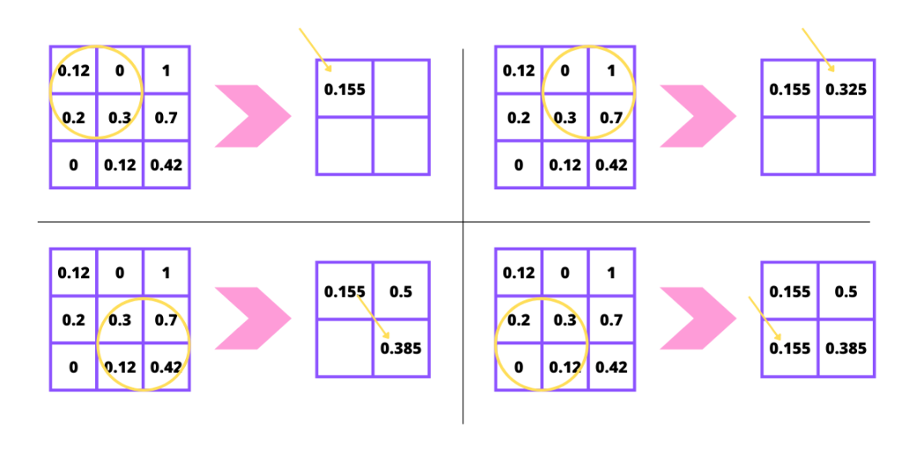

# Convolutional Neural Networks

###### tags: `FreeCodeCamp-MLwithPython`

* [Deep Computer Vision](#deep-computer-vision)
    * [Image Data](#image-data)
* [Convolutional Neural Network](#convolutional-neural-network)
    * [Convulotional Layer](#convolutional-layer)
    * [Multiple Convolutional Layers](#multiple-convolutional-layers)
    * [Feature Maps](#feature-maps)
* [Layer Parameters](#layer-parameters)
    * [Filters](#filters)
    * [Sample Size](#sample-size)
* [Borders and Padding](#borders-and-padding)
* [Strides](#strides)
* [Pooling](#pooling)
* [Object Detection](#object-detection)
* [Sources](#sources)

---

## Deep Computer Vision

The goal of our convolutional neural networks will be to classify and detect images or specific objects from within the image. We will be using image data as our features and a label for those images as our label or output.

The major differences we are about to see in these types of neural networks are the layers that make them up.

### Image Data
So far, we have dealt with pretty straight forward data that has 1 or 2 dimensions. Now we are about to deal with image data that is usually made up of 3 dimensions. These 3 dimensions are as follows:

* image height
* image width
* color channels

---
## Convolutional Neural Network

*(Note: convnet = convolutional neural network)*

Each convolutional neural network is made up of one or many convolutional layers. These layers are different than the dense layers we have seen previously. Their goal is to find patterns from within images that can be used to classify the image or parts of it.

The fundemental difference between a dense layer and a convolutional layer is that dense layers detect patterns globally while convolutional layers detect patterns locally. When we have a densly connected layer each node in that layer sees all the data from the previous layer. This means that this layer is looking at all the information and is only capable of analyzing the data in a global capacity. Our convolutional layer however will not be densly connected, this means it can detect local patterns using part of the input data to that layer.

**Dense Layer**: A dense layer will consider the ENTIRE image. It will look at all the pixels and use that information to generate some output.

**Convolutional Layer**: The convolutional layer will look at specific parts of the image. In this example let's say it analyzes the highlighted parts below and detects patterns there. 

### Convolutional Layer

What we want essentially is our convolutional layer, to give us some output meaningful about the image.

* **First convolutional layer**: returns to us some **feature map** that tells us about the presence of specific what we call **filters** in this image.

At each convolutional layer, we look for many different filters (the number we are typically looking for is about times 32 filters, sometimes we will have 64 filters and sometimes even 128).
* **A Filter**: just some pattern of pixels. The trainable parameter.

Each convolutional layer has a few properties to it:
* **Input Size**.
* Hhow many **filters** are we going to have.
* Whats the **sample size** of our filters (sample size is how big the filters will be).

We have filters and they’ll start completely random, but they’ll change as we go on.

In this example is the sample size is 3x3: The sample is going to look three by three spots in our image and look at the pixels, trying to find how closely this filters match with the pixels we are looking at on each sample.

So this convulotional layer is going to output us what we call a feature map that tells us about the presence of specific features in areas of images.

In this case: for two filters we need two features maps -> **depth two feature map**.

The way we look at the filters is doing the dot product between the yellow square and a filter. We keep with this process till the end:

### Multiple Convolutional Layers

In our models it is quite common to have more than one convolutional layer. Even the basic example we will use in this guide will be made up of 3 convolutional layers. These layers work together by increasing complexity and abstraction at each subsequent layer. The first layer might be responsible for picking up edges and short lines, while the second layer will take as input these lines and start forming shapes or polygons. Finally, the last layer might take these shapes and determine which combiantions make up a specific image.

### Feature Maps

You may see me use the term feature map throughout this tutorial. This term simply stands for a 3D tensor with two spacial axes (width and height) and one depth axis. Our convolutional layers take feature maps as their input and return a new feature map that reprsents the prescence of spcific filters from the previous feature map. These are what we call response maps.

---

## Layer Parameters

A convolutional layer is defined by two key parameters.

### Filters

A filter is a m x n pattern of pixels that we are looking for in an image. The number of filters in a convolutional layer reprsents how many patterns each layer is looking for and what the depth of our response map will be. If we are looking for 32 different patterns/filters than our output feature map (aka the response map) will have a depth of 32. Each one of the 32 layers of depth will be a matrix of some size containing values indicating if the filter was present at that location or not.

Here's a great illustration from the book "Deep Learning with Python" by Francois Chollet (pg 124). 

### Sample Size

This isn't really the best term to describe this, but each convolutional layer is going to examine n x m blocks of pixels in each image. Typically, we'll consider 3x3 or 5x5 blocks. In the example above we use a 3x3 "sample size". This size will be the same as the size of our filter.

Our layers work by sliding these filters of n x m pixels over every possible position in our image and populating a new feature map/response map indicating whether the filter is present at each location. 

---
## Borders and Padding

If we slide a filter of let's say size 3x3 over our image well consider less positions for our filter than pixels in our input. Look at the example below.

Image from "Deep Learning with Python" by Francois Chollet (pg 126).

This means our response map will have a slightly smaller width and height than our original image. This is fine but sometimes we want our response map to have the same dimensions. We can accomplish this by using something called padding.

**Padding** is simply the addition of the appropriate number of rows and/or columns to your input data such that each pixel can be centered by the filter.

In other words: Sometimes we want to make sure that the output feature map, from our original image, is the same dimensions or same size as the original image, and here comes the padding to solve this.

Padding: adding extra row and column on each side of the original image. So when we do our 3x3 sample size, each pixel that we are calculating is in the center of the sample.

---

## Strides

In the previous sections we assumed that the filters would be slid continously through the image such that it covered every possible position. This is common but sometimes we introduce the idea of a stride to our convolutional layer. The stride size reprsents how many rows/cols we will move the filter each time.

In other words: Stride is, essentially, how much we move the sample box, every time that we are about to move it.

The larger your stride, the smaller your output feature map is going to be. So you might want to add more padding (you don't want to add too much padding but it just something to consider).

---

## Pooling

You may recall that our convnets are made up of a stack of convolution and pooling layers.

The idea behind a pooling layer is to downsample our feature maps and reduce their dimensions. They work in a similar way to convolutional layers where they extract windows from the feature map and return a response map of the max, min or average values of each channel.

Pooling is usually done using windows of size 2x2 and a stride of 2. This will reduce the size of the feature map by a factor of two and return a response map that is 2x smaller.

The mentioned are the three basic types of pooling:
* min
* max
* average

In other words: essentially pooling operation is just taking specific values from a sample of the output feature map.

So once we generate this output feature map, what we do to reduce its dimensionality and just make it a little bit easier to work with.

---

## Object Detection

If you'd like to learn how you can perform object detection and recognition with tensorflow check out the guide below.

https://github.com/tensorflow/models/tree/master/research/object_detection

---

## Sources

* “Convolutional Neural Network (CNN)  :   TensorFlow Core.” TensorFlow, www.tensorflow.org/tutorials/images/cnn.
* “Transfer Learning with a Pretrained ConvNet  :   TensorFlow Core.” TensorFlow, www.tensorflow.org/tutorials/images/transfer_learning.
* Chollet François. Deep Learning with Python. Manning Publications Co., 2018.

---

