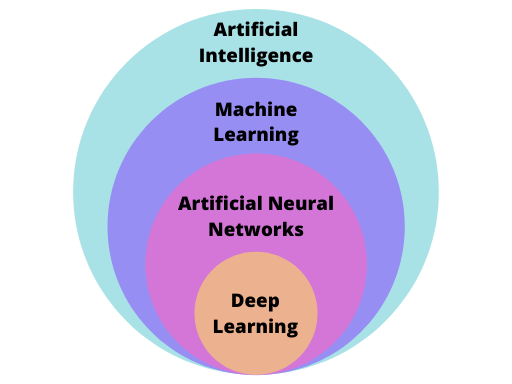

# Introduction to Machine Learning and TensorFlow

###### tags: `FreeCodeCamp-MLwithPython`

* [Machine Learning Fundamentals](##machine-learning-fundamentals)
    * [AI vs Neural Networks vs Machine Learning](###ai-vs-neural-networks-vs-machine-learning)
    * [Data](###data)
* [Introduction to TensorFlow](##introduction-to-tensor-flow)
    * [Setup](###setup)
    * [Tensors](###tensors)   
* [Sources](##sources)<br>
---
## Machine Learning Fundamentals

### AI vs Neural Networks vs Machine Learning




* **AI**: The effort to automate intellectual tasks normally performed by humans.
    1950 -> Can computers think? AI were just a set of rules. AI can be simple or complex.
* **ML**: Takes data, takes what the output should be, and figures out the rules for us. So when we look at new data, we can hace the best possible output for that. That's why a lot of the times ML models do not have 100% accuracy. 

* **NN** or **Deep Learning**: form of ML that uses a layered representation of data. They are not modeled after the brain.


### Data

Data is the most important part of ML and AI.

* **Features**: The <u>input info</u> that we will always have, and we need to give to the model to get some output.
* **Label**: The <u>output</u>, what we are trying to look for, or predict.

---


## Introduction to TensorFlow

### Setup

```python
pip install tensorflow-gpu
%tensorflow_version 2.x  # only if you are in a notebook
import tensorflow as tf  # now import the tensorflow module
print(tf.version)  # make sure the version is 2.x
```

### Tensors

:::info
"A tensor is a generalization of vectors and matrices to potentially higher dimensions. Internally, TensorFlow represents tensors as n-dimensional arrays of base datatypes."    (https://www.tensorflow.org/guide/tensor)
:::


They are the main objects that are passed around and manipulated throughout the program. Each tensor represents a partially defined computation that will eventually produce a value.

Each tensor has a data type and a shape.

Data Types Include: float32, int32, string and others.

Shape: Represents the dimension of data.

#### Create Tensors

```python
#args: value and datatype
string = tf.Variable("this is a string", tf.string) 
number = tf.Variable(324, tf.int16)
floating = tf.Variable(3.567, tf.float64)
```

#### Rank/Degree of Tensors

Rank/Degree: Number of dimensions involved in the tensor.

```python
rank1_tensor = tf.Variable(["Test"], tf.string) 
rank2_tensor = tf.Variable([["test", "ok"], ["test", "yes"]], tf.string)
rank = tf.rank(rank2_tensor)
```

#### Shape of Tensors

Shape: Number of elements that exist in each dimension.
`shape = rank2_tensor.shape`

#### Changing Shape

*Example:*
```python
# tf.ones() creates a shape [1,2,3] tensor full of ones
tensor1 = tf.ones([1,2,3])  
# reshape existing data to shape [2,3,1]
tensor2 = tf.reshape(tensor1, [2,3,1])
# -1 tells the tensor to calculate 
# the size of the dimension in that place
# this will reshape the tensor to [3,3]
tensor3 = tf.reshape(tensor2, [3, -1])  
                                        
#The numer of elements in the reshaped 
#tensor MUST match the number in the original  .                     
```

#### Slicing Tensors

The slice operator can be used on tensors to select specific axes or elements.

*Examples:*

```python
# Creating a 2D tensor
matrix = [[1,2,3,4,5],
          [6,7,8,9,10],
          [11,12,13,14,15],
          [16,17,18,19,20]]

tensor = tf.Variable(matrix, dtype=tf.int32) 
print(tf.rank(tensor))
print(tensor.shape)

# Now lets select some different rows and columns from our tensor

three = tensor[0,2]  # selects the 3rd element from the 1st row
print(three)  # -> 3

row1 = tensor[0]  # selects the first row
print(row1)

column1 = tensor[:, 0]  # selects the first column
print(column1)

row_2_and_4 = tensor[1::2]  # selects second and fourth row
print(row2and4)

column_1_in_row_2_and_3 = tensor[1:3, 0]
print(column_1_in_row_2_and_3)
```


#### Types of Tensors

* Variable
* Constant
* Placeholder
* SparseTensor


## Sources

* https://www.tensorflow.org/guide/tensor


---
