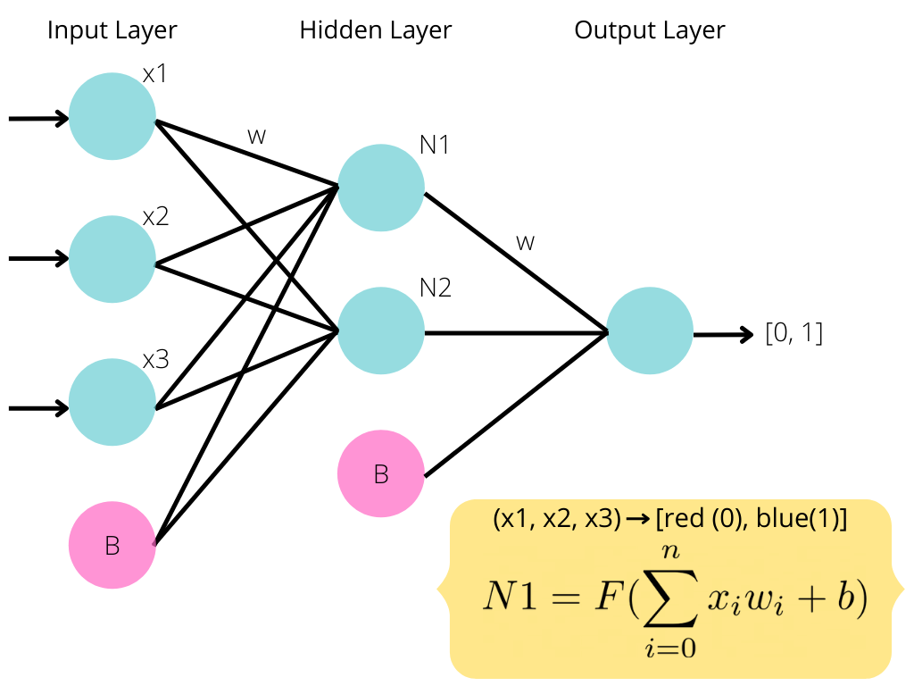
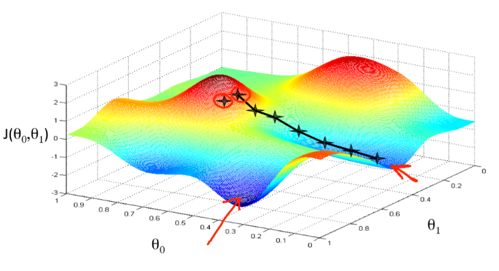

# Neural Networks with TensorFlow

###### tags: `FreeCodeCamp-MLwithPython`

* [Keras](#keras)
* [What is a Neural Network](#what-is-a-neural-network)
* [How it Works](#how-it-works)
* [Breaking Down The Neural Network](#breaking-down-the-neural-network)
    * [Data](#data)
    * [Layers](#layers)
    * [Neurons](#neurons)
    * [Weights](#weights)
    * [Biases](#biases)
    * [Activation Function](#activation-function)
    * [Backpropagation](#backpropagation)
    * [Loss Function](#loss-function)
    * [Gradient Descent](#gradient-descent)
    * [Optimizer](#optimizer)
* [Sources](#sources)

---
## Keras

From the keras official documentation (https://keras.io/):

"Keras is a high-level neural networks API, written in Python and capable of running on top of TensorFlow, CNTK, or Theano. It was developed with a focus on enabling fast experimentation.

Use Keras if you need a deep learning library that:
* Allows for easy and fast prototyping (through user friendliness, modularity, and extensibility).
* Supports both convolutional networks and recurrent networks, as well as combinations of the two.
* Runs seamlessly on CPU and GPU."

---

## What is a Neural Network

A deep neural network is a layered representation of data. The term "deep" refers to the presence of multiple layers. A neural network attempts to represent our data in different ways and in different dimensions by applying specific operations to transform our data at each layer. Another way to express this is that at each layer our data is transformed in order to learn more about it. By performing these transformations, the model can better understand our data and therefore provide a better prediction. 

## How it Works

On a lower level neural networks are simply a combination of elementry math operations and some more advanced linear algebra. Each neural network consists of a sequence of layers in which data passes through. These **layers** are made up on **neurons** and the neurons of one layer are connected to the next. These connections are defined by what we call a weight (some numeric value). Each layer also has something called a bias, this is simply an extra neuron that has no connections and holds a single numeric value. Data starts at the input layer and is trasnformed as it passes through subsequent layers. The data at each subsequent neuron is defined as the following.

The equation above is called a weighed sum. We will take this weighted sum at each and every neuron as we pass information through the network. Then we will add what's called a bias to this sum. The bias allows us to shift the network up or down by a constant value. It is like the y-intercept of a line.

But that equation is the not complete one! We forgot a crucial part, the **activation function**. This is a function that we apply to the equation seen above to add complexity and dimensionality to our network. Our new equation with the addition of an activation function `F(x)` is seen below.

Our network will start with predefined activation functions (they may be different at each layer) but random weights and biases. As we train the network by feeding it data it will learn the correct weights and biases and adjust the network accordingly using a technqiue called **backpropagation**. Once the correct weights and biases have been learned our network will hopefully be able to give us meaningful predictions. We get these predictions by observing the values at our final layer, the output layer. 

----

## Breaking Down The Neural Network

### Data

The type of data a neural network processes varies drastically based on the problem being solved. When we build a neural network, we define what shape and kind of data it can accept. It may sometimes be neccessary to modify our dataset so that it can be passed to our neural network.

Some common types of data a neural network uses are listed below.
* Vector Data (2D)
* Timeseries or Sequence (3D)
* Image Data (4D)
* Video Data (5D)

### Layers

As we mentioned earlier each neural network consists of multiple layers. At each layer a different transformation of data occurs. Our initial input data is fed through the layers and eventually arrives at the output layer where we will obtain the result.
* **Input Layer**: is the layer that our initial data is passed to. It is the first layer in our neural network.
* **Output Layer**: is the layer that we will retrive our results from. Once the data has passed through all other layers it will arrive here.
* **Hidden Layer(s)**: All the other layers in our neural network are called "hidden layers". This is because they are hidden to us, we cannot observe them. Most neural networks consist of at least one hidden layer but can have an unlimited amount. Typically, the more complex the model the more hidden layers.

#### Connected Layers

The neurons can be connected in a variety of different ways.
If each neuron in one layer is connected to every neuron in the next layer, is called a **dense layer**.

### Neurons

Each layer is made up of what are called neurons. Each neuron is responsible for generating/holding/passing ONE numeric value.

This means that in the case of our input layer it will have as many neurons as we have input information. For example, say we want to pass an image that is 28x28 pixels, thats 784 pixels. We would need 784 neurons in our input layer to capture each of these pixels.

This also means that our output layer will have as many neurons as we have output information.

The hidden layers can have as many neurons as we decide.

### Weights

Weights are associated with each connection in our neural network. Every pair of connected nodes will have one weight that denotes the strength of the connection between them. These are vital to the inner workings of a neural network and will be tweaked as the neural network is trained. The model will try to determine what these weights should be to achieve the best result. Weights start out at a constant or random value and will change as the network sees training data.

### Biases

Biases are another important part of neural networks and will also be tweaked as the model is trained. A bias is simply a constant value associated with each layer. It can be thought of as an extra neuron that has no connections. The purpose of a bias is to shift an entire activation function by a constant value. This allows a lot more flexibllity when it comes to choosing an activation and training the network. There is one bias for each layer.

### Activation Function

Activation functions are simply a function that is applied to the weighed sum of a neuron. They can be anything we want but are typically higher order/degree functions that aim to add a higher dimension to our data. We would want to do this to introduce more comolexity to our model. By transforming our data to a higher dimension, we can typically make better, more complex predictions.

Some common activation functions:
* **Relu (Rectified Linear Unit)**

* **Tanh (Hyperbolic Tangent)**

* **Sigmoid**

### Backpropagation

Backpropagation is the fundemental algorithm behind training neural networks. It is what changes the weights and biases of our network. To fully explain this process, we need to start by discussing something called a cost/loss function.

### Loss Function

As we now know our neural network feeds information through the layers until it eventually reaches an output layer. This layer contains the results that we look at to determine the prediciton from our network. In the training phase it is likely that our network will make many mistakes and poor predicitions. In fact, at the start of training our network doesn't know anything (it has random weights and biases)!

We need some way of **evaluating** if the network is doing well and how well it is doing. For our training data we have the **features** (input) and the **labels** (expected output), because of this we can compare the output from our network to the expected output. Based on the difference between these values we can determine if our network has done a good job or poor job. If the network has done a good job, we'll make minor changes to the weights and biases. If it has done a poor job our changes may be more drastic.

So, this is where the **cost/loss function** comes in. This function is responsible for determining how well the network did. We pass it the output and the expected output, and it returns to us some value representing the cost/loss of the network. This effectively makes the networks job to optimize this cost function, trying to make it as low as possible.

Some common loss/cost functions include.
* Mean Squared Error
* Mean Absolute Error
* Hinge Loss

### Gradient Descent

Gradient descent and backpropagation are closely related. Gradient descent is the algorithm used to find the optimal paramaters (weights and biases) for our network, while backpropagation is the process of calculating the gradient that is used in the gradient descent step. We are looking for the global minimum. The minimum point where we get the least possible lost from our neural network.

"Gradient descent is an optimization algorithm used to minimize some function by iteratively moving in the direction of steepest descent as defined by the negative of the gradient. In machine learning, we use gradient descent to update the parameters of our model." (https://ml-cheatsheet.readthedocs.io/en/latest/gradient_descent.html)

### Optimizer

You may sometimes see the term optimizer or optimization function. This is simply the function that implements the backpropagation algorithm described above. Here's a list of a few common ones.

* Gradient Descent
* Stochastic Gradient Descent
* Mini-Batch Gradient Descent
* Momentum
* Nesterov Accelerated Gradient

This article explains them quite well is where I've pulled this list from.
(https://medium.com/@sdoshi579/optimizers-for-training-neural-network-59450d71caf6)

----

## Sources 

* Doshi, Sanket. “Various Optimization Algorithms For Training Neural Network.” Medium, Medium, 10 Mar. 2019, www.medium.com/@sdoshi579/optimizers-for-training-neural-network-59450d71caf6.
* “Basic Classification: Classify Images of Clothing  :   TensorFlow Core.” TensorFlow, www.tensorflow.org/tutorials/keras/classification.
* “Gradient Descent¶.” Gradient Descent - ML Glossary Documentation, www.ml-cheatsheet.readthedocs.io/en/latest/gradient_descent.html.
* Chollet François. Deep Learning with Python. Manning Publications Co., 2018.
* “Keras: The Python Deep Learning Library.” Home - Keras Documentation, www.keras.io/.

---
